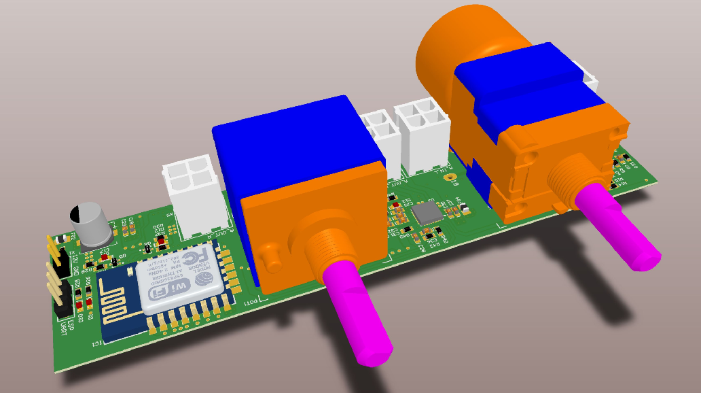

# **BC2_VolCtrl**



> The BC2_VolCtrl PCB implements a universal volume control based on the popular ALPS RK168 motor potentiometer. Balance setting is available via knob control only. The volume can be controlled via
>
> - The old school way, turning the knob
>
> - Standard infrared remote controls (several IR protocols)
> - Telnet interface (Wi-Fi)
>
> The PCB was designed for the Black Cat 2 audio tube amplifier. As the design of the PCB is universal, it may be easily integrated in other do-it-yourself amplifier projects.
>
> The amplifier itself was designed by  Henry Westphal and his students at the technical university of Berlin in Germany. Schematic and documentation are available [here](https://www.emsp.tu-berlin.de/menue/studium_und_lehre/mixed_signal_baugruppen_alt/das_projekt_black_cat/) (only German). 
>
> The amplifier lacks a remote control for the volume. The appearance is retro with a complete analog signal chain. I wanted to keep the signal chain analog. A motorized potentiometer fits well.

[](https://coveralls.io/r/badges/badgerbadgerbadger) 

## Table of Contents (Optional)

- [Features](#Features)
- [Description](Description)

## **Features**

> A list of handy features and functions of the PCB and firmware.

### Functions 

- Motor potentiometer for a complete analog signal chain
- Balance setting via knob control
- Simultaneous use of multiple IR-Remotes (i.e. control via both TV and CD-Player remotes )
- Support of multiple IR-protocols (Sony, NEC, RC5, ...)
- Position recognition of volume potentiometer
- Set-up via a simple command based telnet Wi-Fi connection
- Volume control via a telnet Wi-Fi connection (Andriod APP required)
- ESP-Link firmware with all features on the ESP8266 - Wi-Fi module

### Circuit Design 

- LT3622 wide Vin step down converter (designed for VCC=12V)
- ATmega 328pb Atmel microcontroller
- UART-1 and one GPIO available at external connector (unsed)
- Black-Cat 2 tube amp compatible connectors and layout
- Layout and GND separation of control and analog signals
- Stop position recognition of volume potentiometer for improved lifetime
- H-bridge motor driver with 15us shoot through protection
- Several debugging LEDs
- Farnell bill of materials

## Description

### IR Protocols

The firmware uses the awesome [irmp library (Infrared Multiprotocol Decoder)]( https://www.mikrocontroller.net/articles/IRMP_-_english#top) written by Frank Meyer. The library is able to decode several infrared protocols (refer to IRMP documentation for a complete list). Most of the IR-protocols have a unique start bit timing which IRMP uses to distinguish different protocols. 

To enable or disable protocols simply edit /FW/IMRP/irmpconfig.h. Every protocol will require a few bytes of RAM. By default the most common IR-protocols are enabled:

```c
#define IRMP_SUPPORT_SIRCS_PROTOCOL		1  		// Sony SIRCS 			~150 bytes
#define IRMP_SUPPORT_NEC_PROTOCOL 		1       // NEC + APPLE 			~300 bytes
#define IRMP_SUPPORT_SAMSUNG_PROTOCOL   1       // Samsung + Samsg32  	~300 bytes
#define IRMP_SUPPORT_KASEIKYO_PROTOCOL  1       // Kaseikyo 			~250 bytes
#define IRMP_SUPPORT_RC5_PROTOCOL       1       // RC5 					~250 bytes
#define IRMP_SUPPORT_RCII_PROTOCOL      1       // RCII T+A 			~250 bytes
```

Some IR-Remotes i.e. from CD-Players use different protocols for the majority of function keys and volume controls. For example my camebride audio CD-player remote uses the camebrige protocol for all function keys and the RC5 protocol for the volume up an down keys. 

### Telnet Command Set


## Manufacturing

## Things to consider for implementation in your amplifier project


- eingangsimpedanz der vorstufe

- 

  ## BC2 implementation 

- 

## First time setup


- Most people will glance at your `README`, *maybe* star it, and leave
- Ergo, people should understand instantly what your project is about based on your repo

> Tips

- HAVE WHITE SPACE
- MAKE IT PRETTY
- GIFS ARE REALLY COOL

> GIF Tools

- Use <a href="http://recordit.co/" target="_blank">**Recordit**</a> to create quicks screencasts of your desktop and export them as `GIF`s.
- For terminal sessions, there's <a href="https://github.com/chjj/ttystudio" target="_blank">**ttystudio**</a> which also supports exporting `GIF`s.

**Recordit**


**ttystudio**


---

## Example (Optional)

```javascript
// code away!

let generateProject = project => {
  let code = [];
  for (let js = 0; js < project.length; js++) {
    code.push(js);
  }
};
```

---

## Installation

- All the `code` required to get started
- Images of what it should look like

### Clone

- Clone this repo to your local machine using `https://github.com/fvcproductions/SOMEREPO`

### Setup

- If you want more syntax highlighting, format your code like this:

> update and install this package first

```shell
$ brew update
$ brew install fvcproductions
```

> now install npm and bower packages

```shell
$ npm install
$ bower install
```

- For all the possible languages that support syntax highlithing on GitHub (which is basically all of them), refer <a href="https://github.com/github/linguist/blob/master/lib/linguist/languages.yml" target="_blank">here</a>.

---

## Features
## Usage (Optional)
## Documentation (Optional)
## Tests (Optional)

- Going into more detail on code and technologies used
- I utilized this nifty <a href="https://github.com/adam-p/markdown-here/wiki/Markdown-Cheatsheet" target="_blank">Markdown Cheatsheet</a> for this sample `README`.

---

## Contributing

> To get started...

### Step 1

- **Option 1**
    - 🍴 Fork this repo!

- **Option 2**
    - 👯 Clone this repo to your local machine using `https://github.com/joanaz/HireDot2.git`

### Step 2

- **HACK AWAY!** 🔨🔨🔨

### Step 3

- 🔃 Create a new pull request using <a href="https://github.com/joanaz/HireDot2/compare/" target="_blank">`https://github.com/joanaz/HireDot2/compare/`</a>.

---

## Team

> Or Contributors/People

| <a href="http://fvcproductions.com" target="_blank">**FVCproductions**</a> | <a href="http://fvcproductions.com" target="_blank">**FVCproductions**</a> | <a href="http://fvcproductions.com" target="_blank">**FVCproductions**</a> |
| :---: |:---:| :---:|
| [](http://fvcproductions.com)    | [](http://fvcproductions.com) | [](http://fvcproductions.com)  |
| <a href="http://github.com/fvcproductions" target="_blank">`github.com/fvcproductions`</a> | <a href="http://github.com/fvcproductions" target="_blank">`github.com/fvcproductions`</a> | <a href="http://github.com/fvcproductions" target="_blank">`github.com/fvcproductions`</a> |

- You can just grab their GitHub profile image URL
- You should probably resize their picture using `?s=200` at the end of the image URL.

---

## FAQ

- **How do I do *specifically* so and so?**
    - No problem! Just do this.

---

## Support

Reach out to me at one of the following places!

- Website at <a href="http://fvcproductions.com" target="_blank">`fvcproductions.com`</a>
- Twitter at <a href="http://twitter.com/fvcproductions" target="_blank">`@fvcproductions`</a>
- Insert more social links here.

---

## Donations (Optional)

- You could include a <a href="https://cdn.rawgit.com/gratipay/gratipay-badge/2.3.0/dist/gratipay.png" target="_blank">Gratipay</a> link as well.

[](https://gratipay.com/fvcproductions/)

---

## License

[](http://badges.mit-license.org)

- **[MIT license](http://opensource.org/licenses/mit-license.php)**
- Copyright 2015 © <a href="http://fvcproductions.com" target="_blank">FVCproductions</a>.
